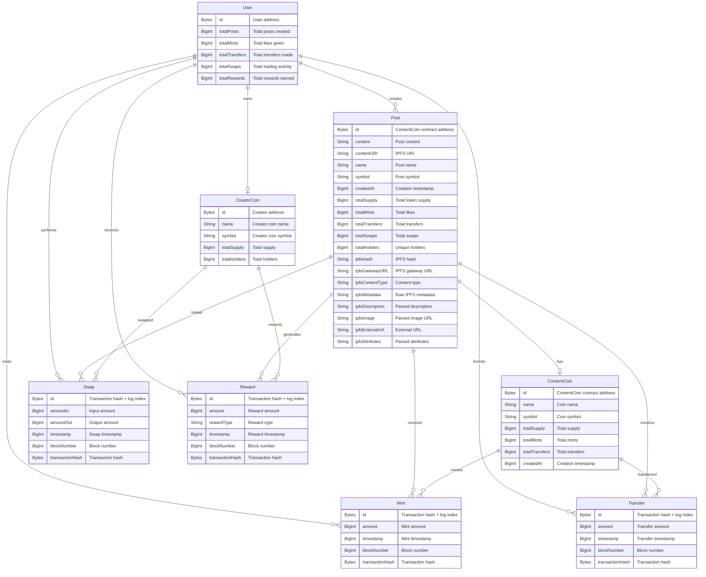

# Zora Social Network Subgraph

A high-performance subgraph that tracks Zora's social network by monitoring ContentCoins (ERC-20 tokens representing social posts) and their engagement through minting activity on Base chain.

## 🚀 Features

- **Social Posts**: Tracks ContentCoins as social posts
- **Engagement**: Monitors "likes" through minting/transfer events
- **Creator Economics**: Tracks CreatorCoin interactions and rewards
- **Real-time Metrics**: Live social engagement data
- **Optimized Performance**: Implements all 6 Graph best practices

## 📊 What It Tracks

### Posts (ContentCoins)
- Content creation and metadata
- Creator information
- Total supply and minting activity
- Trading volume and engagement

### Users
- Creator profiles and activity
- Engagement metrics (posts, mints, swaps)
- Creator coin ownership

### Social Engagement
- **Likes** = Transfer/Mint events (Zora's unique minting-based engagement)
- Trading activity and volume
- Reward distributions
- Creator support metrics

## 🏗️ Architecture

### Contracts Monitored
- **ZoraFactoryImpl**: `0x777777751622c0d3258f214F9DF38E35BF45baF3`
- **ContentCoin**: Dynamic addresses (created by factory)
- **CreatorCoin**: Dynamic addresses (created by factory)

### Network
- **Base Chain** (Chain ID: 8453)
- **Start Block**: 10,000,000

## 🚀 Quick Start

### Prerequisites
- Node.js 18+
- Yarn package manager
- Graph CLI: `yarn global add @graphprotocol/graph-cli`

### Installation
```bash
git clone https://github.com/PaulieB14/zora-subgraph.git
cd zora-subgraph
yarn install
```

### Development
```bash
# Generate types
graph codegen

# Build subgraph
graph build

# Deploy to Studio
graph deploy --version-label v2.6.0 zora
```

## 📈 Query Examples

### Get All Posts with IPFS Content
```graphql
{
  posts(first: 10, orderBy: createdAt, orderDirection: desc) {
    id
    creator
    content
    contentURI
    name
    symbol
    totalSupply
    totalMints
    totalHolders
    createdAt
    # IPFS Content Fields
    ipfsHash
    ipfsDescription
    ipfsImage
    ipfsExternalUrl
    ipfsContentType
  }
}
```

### Get User Engagement
```graphql
{
  users(first: 10) {
    id
    totalPosts
    totalMints
    totalTransfers
    totalSwaps
    totalRewards
    posts {
      content
      contentURI
      totalSupply
      ipfsDescription
      ipfsImage
    }
  }
}
```

### Get Recent Activity with IPFS Content
```graphql
{
  mints(first: 10, orderBy: timestamp, orderDirection: desc) {
    id
    post {
      content
      contentURI
      ipfsDescription
      ipfsImage
      creator
    }
    minter
    amount
    timestamp
  }
}
```

### Query Posts by IPFS Content
```graphql
{
  posts(where: { ipfsDescription_contains: "NFT" }, first: 5) {
    id
    name
    contentURI
    ipfsHash
    ipfsDescription
    ipfsImage
    ipfsExternalUrl
    creator
    totalMints
  }
}
```

## 🔗 Live Endpoints

- **Studio URL**: https://thegraph.com/studio/subgraph/zora
- **Query Endpoint**: https://api.studio.thegraph.com/query/111767/zora/v2.6.0
- **GitHub**: https://github.com/PaulieB14/zora-subgraph

## ⚡ Performance Optimizations

This subgraph implements all 6 Graph best practices:

1. **Pruning**: `indexerHints: prune: auto` for fast queries
2. **@derivedFrom**: Efficient entity relationships
3. **Immutable Entities**: All event entities with Bytes IDs
4. **No eth_calls**: Event-driven architecture only
5. **Timeseries**: Real-time social metrics
6. **Grafting Ready**: Hotfix deployment support

## 📁 Project Structure

```
zora-subgraph/
├── schema.graphql          # GraphQL schema definition
├── subgraph.yaml          # Subgraph configuration
├── src/
│   └── mapping.ts         # Event handlers
├── abis/
│   ├── ZoraFactoryImpl.json
│   ├── ContentCoin.json
│   └── CreatorCoin.json
├── generated/             # Auto-generated types
├── build/                 # Build artifacts
└── package.json
```

## 🛠️ Development

### Adding New Events
1. Update `schema.graphql` with new entities
2. Add event handlers in `src/mapping.ts`
3. Update `subgraph.yaml` with new event mappings
4. Run `graph codegen && graph build`

### Updating Contract Addresses
Edit `subgraph.yaml` and update the `address` field for the relevant data source.

## 📊 Schema Overview

### Entity Relationship Diagram



### Core Entities
- **Post**: ContentCoins representing social posts with IPFS content
- **User**: Creator and user profiles with engagement metrics
- **CreatorCoin**: Creator-specific coins for trading
- **ContentCoin**: Token contracts for individual posts
- **Mint**: Minting events (likes/engagement)
- **Transfer**: Token transfers between users
- **Swap**: Trading activity with creator coins
- **Reward**: Reward distributions to creators

### IPFS Integration
The schema now includes comprehensive IPFS support:
- **Content Fetching**: Automatic IPFS content retrieval
- **Metadata Parsing**: JSON metadata extraction
- **Field Mapping**: Common fields like description, image, external URL
- **Gateway Support**: Multiple IPFS gateway redundancy

## 🤝 Contributing

1. Fork the repository
2. Create a feature branch
3. Make your changes
4. Test thoroughly
5. Submit a pull request

## 📄 License

MIT License - see LICENSE file for details

## 🔗 Links

- [Zora Documentation](https://docs.zora.co/coins)
- [The Graph Documentation](https://thegraph.com/docs)
- [Base Network](https://base.org)

## 📞 Support

For issues and questions:
- GitHub Issues: https://github.com/PaulieB14/zora-subgraph/issues
- Zora Support: https://support.zora.co
